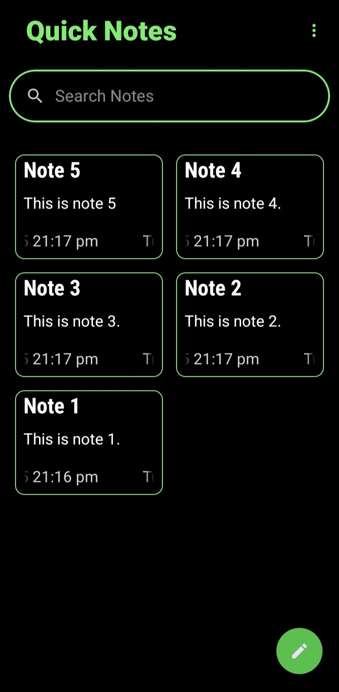
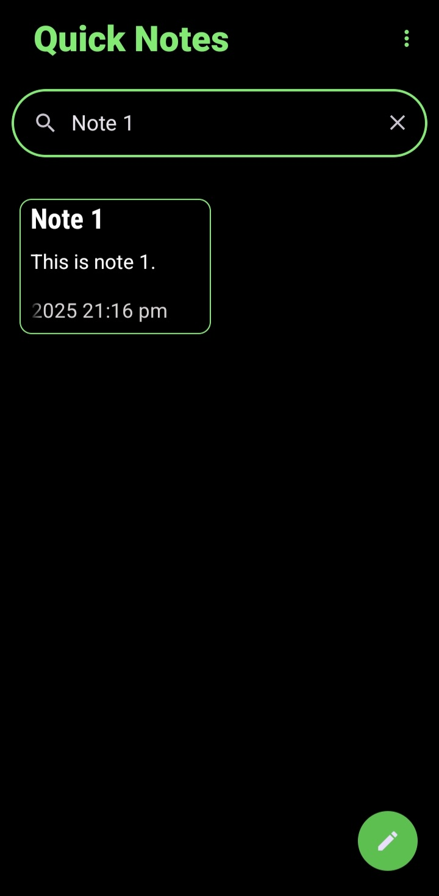
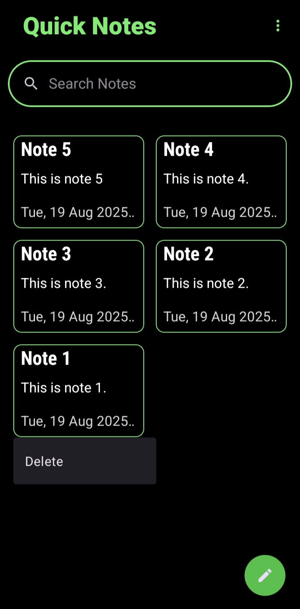
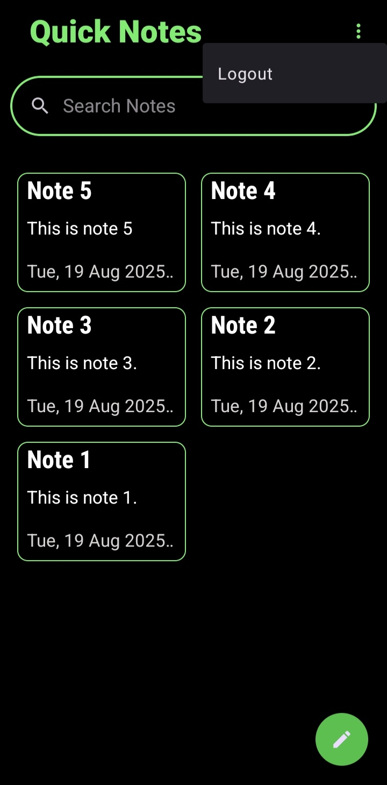

# Quick Notes - Note Taking Android App

Quick Notes is a clean, simple, and intuitive note-taking application for Android, built with Java. It provides a seamless experience for creating, viewing, updating, and deleting notes. The app features a secure local authentication system using the ROOM library to keep your notes private and accessible only to you.

---

## Features

* **Secure Authentication**: A robust signup and login system ensures your notes are secure.
* **Intuitive Dashboard**: A clean grid layout displays all your notes, showing the title, description, and creation timestamp.
* **Full CRUD Operations**:
    * **Create**: Easily add new notes using a floating action button.
    * **Read**: View all your notes at a glance on the dashboard.
    * **Update**: Simply tap on any note to open the editor and make changes.
    * **Delete**: Long-press on a note to quickly delete it.
* **Powerful Search**: Instantly find the note you're looking for with the integrated search bar.
* **Offline Storage**: Leverages the Android ROOM persistence library for fast and reliable offline data access.
* **User Session Management**: A secure logout option is available in the menu.

---

## Application Flow & Screenshots

Here is a visual guide to the core features of Quick Notes.

### App Entry
| Splash Screen                          |
| :------------------------------------- |
|  |

### Authentication
| Signup Screen                          | Login Screen                         |
| :------------------------------------- | :----------------------------------- |
|   |   |

### Main Dashboard & Core Actions
| Dashboard & Notes Grid                       | Searching for a Note                     |
| :------------------------------------------- | :--------------------------------------- |
|          |            |

| Add a New Note                             | Update an Existing Note                      |
| :----------------------------------------- | :------------------------------------------- |
|               |           |

### Other Actions
| Deleting a Note (on long-press)            | Logout (from menu)                         |
| :----------------------------------------- | :----------------------------------------- |
|         |              |

---

## Technology Stack

* **Language**: Java
* **Platform**: Android
* **Database**: Android ROOM Persistence Library

---

## How To Use

1.  **Clone the repository:**
    ```bash
    git clone https://github.com/MHuzaifaHussain/Quick-Notes.git
    ```
2.  **Open in Android Studio:**
    * Open Android Studio.
    * Click on `File` > `Open` and navigate to the cloned project directory.
3.  **Build and Run:**
    * Let Android Studio sync the Gradle files.
    * Click the `Run` button to build and install the app on an emulator or a physical device.
